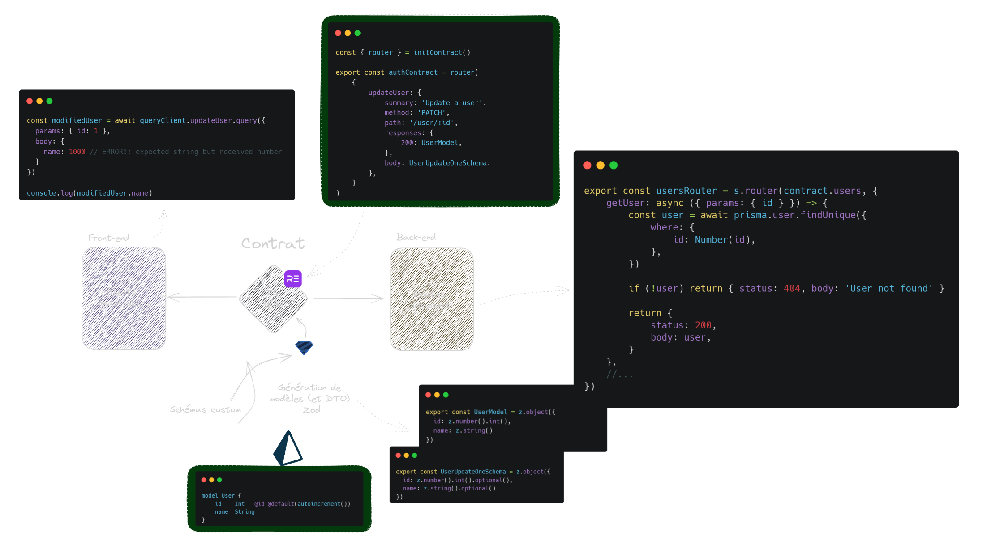

# ProcrastIn

> Monorepo for the **ProcrastIn** school project (ESTIAM).

- [Project structure](#project-structure)
- [Comprendre le projet](#comprendre-le-projet)
  - [Technologies](#technologies)
- [Quelques points clés](#quelques-points-clés)
    - [Automatisation](#automatisation)
    - [Monorepo](#monorepo)
    - [\[WIP\] CLI](#wip-cli)
- [Requirements](#requirements)
  - [Initialize the project](#initialize-the-project)
- [Usage](#usage)
  - [Client](#client)
    - [Start](#start)
  - [Server](#server)
    - [Start](#start-1)
  - [Prisma (database)](#prisma-database)
    - [Generate the client](#generate-the-client)
    - [Migrate the database](#migrate-the-database)
    - [Seed the database](#seed-the-database)
  - [CLI commands](#cli-commands)


## Project structure

```bash
/
├── apps
│   ├── server # Fastify API
│   └── client # React Native app 
└── libs
    ├── contract # The shared API contract w/ auto-generated client services and typescript models for the front-end
    ├── prisma # All prisma related things
```

## Comprendre le projet

*(en français pour une meilleure compréhension)*

Ce projet repose sur 4 principes :

- La robustesse du code
- La facilité de développement
- La vitesse de développement
- La maintenabilité dans le temps

Tout est mis en oeuvre pour maximiser au possible ces 4 principes, que ce soit par les technologies choisies, les méthodes employées, les systèmes mis en place ou encore le code produit.

### Technologies

Outre les technologies imposées par le projet, nous avons choisi d'utiliser :
- `react native` pour le front-end mobile. Il s'agit d'un framework très performant et très moderne qui permet de faire des applications mobiles de manière efficace et rapide, le tout pour iOS et Android sans avoir à développer deux bases de code différentes.
- `expo` pour faciliter le développement de l'application mobile en React Native.
- `moonrepo` pour gérer l'entiereté du projet dans un seul repository git. Il s'agit d'un outil qui permet de gérer un monorepo de manière efficace.
- `ts-rest` comme solution de contrat API. Cet outil nous permet, à l'instar de OpenAPI, de déclarer un contrat d'API et de générer automatiquement un client pour cette API. Cela permet de gagner du temps de développement et de s'assurer que le client et le serveur sont toujours en accord.
- `@tanstack/query` (anciennement `react-query`) nous permet de gérer les appels API de manière efficace et de gérer le cache de manière transparente. Cela permet de gagner du temps de développement et de s'assurer que les appels API sont toujours cohérents.
- ci/cd complet `github actions`
- `eslint` et `prettier` pour les configuration de standardisation de code.

## Quelques points clés

#### Automatisation

L'un des points clés de ce projet réside dans la mise en place de tout un système d'auto-génération de code et d'extraction de type de code afin d'avoir un typage bout-en-bout constant et juste ainsi une synchronisation des modèles de données entre le back-end et le front-end. Ce simple point permet de grandement améliorer la robustesse du code, la facilité ainsi que la vitesse de développement et enfin la maintenabilité dans le temps. C'est à dire nos 4 principes de refonte cités précédement.

Dans notre cas précis, la "Single Source of Truth" (seule source de vérité) est le contrat [ts-rest](https://ts-rest.com/). De plus, nous avons ajouté des outils nous permettant de générer automatiquement des schéma Zod (utilisés ensuite dans *ts-rest*) à partir de notre schéma Prisma.



#### Monorepo

Un monorepo permet de gérer l'entiereté du projet dans un seul repository git. Cela permet de gérer les dépendances entre les projets, de gérer les tests, les builds, les générateurs de code, etc. 

Il est très important dans notre cas puisque l'on peut ainsi gérer à la fois le back-end et le front-end dans le même repository, et donc faciliter l'auto-génération et la synchronisation des modèles de données et des types entre le back-end et le front-end.

#### \[WIP\] CLI

L'utilisation d'un CLI fait maison adapté aux besoins spécifiques du projet permet de générer facilement des nouveaux composants, pages, etc. Cela permet de gagner énormement de temps et de s'assurer que les composants sont toujours cohérents entre eux.

## Requirements

- [Node.js](https://nodejs.org/en/) (>=20)
- [pnpm](https://pnpm.io/) `npm i -g pnpm`
- [moon](https://moon.dev) `pnpm i -g @nx/moon`

### Initialize the project

1. Install Node dependencies
    ```bash
    pnpm install
    ```
2. Run the API migrations
    ```bash
    npm run nx run api:migrate
    ```

## Usage

### Client

#### Start

```bash
moon run client:start
```

### Server

#### Start

```bash
moon run server:start
```

### Prisma (database)

#### Generate the client

#### Migrate the database

```bash
npm run prisma:migrate
```

```bash
npm run nx run prisma:generate
```

#### Seed the database

> ⚠️ **Warning**: You'll need a fully fledged .env file

```bash
npm run nx run prisma:seed
```

### CLI commands

In addition to classic `nx` generators commands, the project have additionnal commands to help with development by generating different type of files:

-   `npm run g:web`: Generate files for `apps/web`. It can generate following types of files dynamically:
    -   `component`: Generate a component.
    -   `page`: Generate a page.
-   `npm run g:ui`: Generate files for `libs/ui`. It can generate following types of files dynamically:
    -   `component`: Generate a component with a storybook story.